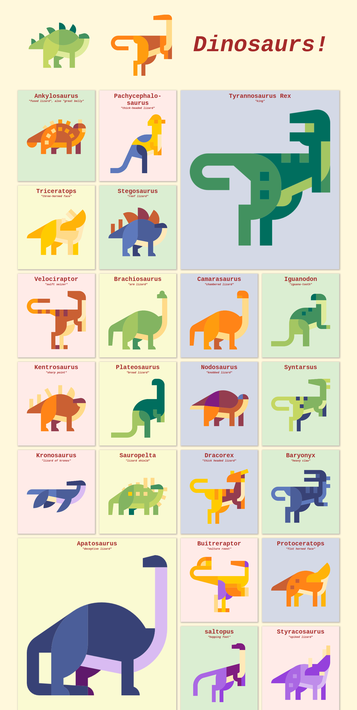

# Dinosaurs!

Keep these dinosaurs from becoming extinct by giving them an SCSS boost!

## Installation

Run `npm install`

## Usage

- To run the live server, run `npm run serve`
- To run the SASS file watcher run `npm run scss-watch`
- For a one-time SASS/SCSS build, run `npm run scss-compile`
- For a one-time SASS linter check, run `npm run sass-lint`

## Preparing for your assignments

**Important!** Before working on these assignments, please make sure to create
a new branch with the name "solution" in the terminal;

`git checkout -b solution`

When you have finished making your changes, use the following command to mark all changed files
to be added to the next commit;

`git add .`

And then commit as follows;

`git commit -m "Your message"`

Replace the text _Your message_ with something a short summary of the changes you've made

It's good practise to separate your code changes into multiple commits,
for example - if you're building a website, you might want to have 1 commit for your header code,
one for your navigation code, etc.

## Submitting your assignments

Once you've finished your changes and you are ready to submit your work, you can push the changes
to the remote server via the following commands;

If you've already pushed before, you can simply use:

`git push`

If however you get an error, telling you the remote branch for "solution" does not exist, use the
following command:

`git push --set-upstream origin solution`

Once this is done, create a **Pull Request** from the `solution` branch to the `master` branch
via the GitHub interface.

## Assignments

Take time to do some research if you need to refresh your knowledge on SASS / SCSS.

You may wish to refer to these resources:

[Official documentation](https://sass-lang.com/guide)

[The Complete Guide to SCSS/SASS](https://www.freecodecamp.org/news/the-complete-guide-to-scss-sass-30053c266b23/)

[What's the difference between SCSS and Sass?](https://stackoverflow.com/questions/5654447/whats-the-difference-between-scss-and-sass)

### 1. Using SASS partials

+ Create the file `_variables.scss` inside the `source/styles` folder.

The underscore "_" means this file will not be emitted. This is called a SASS partial.

### 2. Using SASS import

+ Import the file `_variables.scss` into the file `source/styles/styles.scss`
using the `@import` keyword.
+ Do the same for the file `_reset.scss`. This is where we will remove any browser default styles.

You don't need to include the `.scss` extension, as SASS will understand.

Including the underscore "_" is optional, but leaving it in helps you understand that this file is a partial.

### 3. Using variables

+ Inside this variables file, create variables for all the colours used in the file `source/styles/styles.scss`
+ Inside the variables file, create a variable for the font-weight `600`
+ Inside the file, `source/styles/styles.scss`, replace the appropriate values with the variables you created above.

### 4 - Nesting

+ Inside the file, `source/styles/styles.scss`, look for instances where you might employ nesting.
Apply nesting to those places.

Hint: To easily identify CSS which can be nested, look for combined selectors,
for example the selector `.parent .child` means class `.child` can be nested under `.parent`.

### 5 - Converting

Now your CSS to SCSS conversion is complete, we need to convert it back again into CSS
so that the browser can read it. Run the following command in your command line to run
the watcher:

`npm run scss-watch`

The process this command runs will consume your terminal (you can not use it for anything else).
You will need to open a new terminal if you need to interact with the shell, for example,
to run the `live-server`:

`npm run serve`

### 6 - Styling it up with CSS Grid

The styles have only been partially written. Use CSS Grid to complete the layout.

[Learn CSS Grid](https://learncssgrid.com/)

#### 6.a - Lay your cards out

+ Add some styles to allow the elements affected by class `panel`:
    - to be displayed in a row, on devices with a minimum screen width of `1024px`
    - ensure that only 4 `panel`s of equal size are displayed on a single row

Hint 1: Use the new CSS Grid property you learned
Hint 2: For the first part, you will need to affect the parent `dino-book`.
Hint 3: You can use the new fractional unit (`fr`)

[Fractional units](https://css-tricks.com/introduction-fr-css-unit/)

#### 6.b - Repeat robot

If you wrote the above code correctly, you should have 4 identical property values

+ Use the CSS `repeat()` function to make the above line a little smaller

[CSS repeat](https://developer.mozilla.org/en-US/docs/Web/CSS/repeat)

#### 6.c - In the shadow of a dinosaur

+ Let's add some effects. Add the following CSS property to the class `panel`
for devices with a minimum screen width of `1024px`.
    - `box-shadow: 2px 2px 5px 2px rgba(100, 92, 112, 0.425);`

[Box-shadow](https://developer.mozilla.org/en-US/docs/Web/CSS/box-shadow)

#### 6.d - Give me those dino facts!

+ Add some styles, so that the class `panel__data` is positioned absolutely to the
bottom left of it's nearest parent element
+ Add some styles, so that the class `panel__data` is hidden by default
+ Add some styles, so that when class `panel` is in the hover state,
class `panel__data` is visible.

#### 6.e - ...but not everything on mobile!

+ Hide the class `panel__subtitle` on mobile

### 7 - Jealousy abounds!

Hark! Some dinosaurs are jealous of their neighbours, and demand their due respect!

#### 7.a - Keep those dinos apart!

The dinosaurs are too close together!

+ `20px` should be enough to keep the dinos from eating each other.
Use the new CSS grid property to keep them apart.

[Grid gap](https://developer.mozilla.org/en-US/docs/Web/CSS/gap)

#### 7.b - The King

The dinosaur "Tyrannosaurus Rex" is super jealous, and demands that it's image be bigger
than the others!

+ Adjust the sizing of the T-Rex's image so that it's image is double the height and width
of any other dinosaur

[Grid row](https://developer.mozilla.org/en-US/docs/Web/CSS/grid-row)
[Grid column](https://developer.mozilla.org/en-US/docs/Web/CSS/grid-column)

Hint: Use the CSS Grid properties `grid-row` and `grid-column`

#### 7.c - The usurper

Aptosaurus was a pretty big dinosaur for it's time! It demands to be heard!

+ Adjust the sizing of Aptosaurus' image so that it's image is double the height and width
of any other dinosaur

With any luck, your finished result should look something like this!

